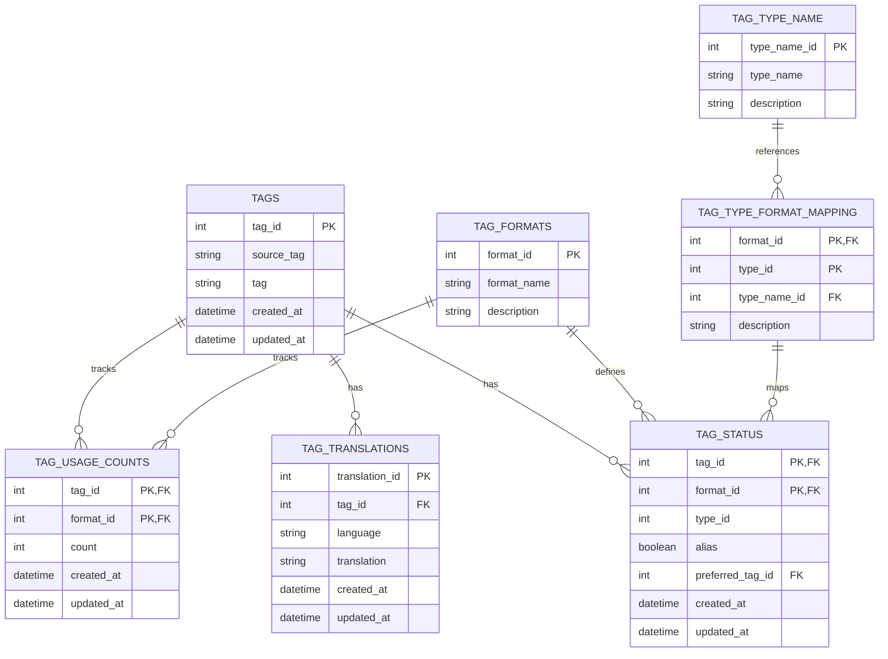

# genai-tag-db-tools 設計メモ

## 1. 概要

**プロジェクト名:** genai-tag-db-tools

**目的:**
本ツールは、画像生成AIで使用されるタグ情報を統合的に管理するためのデータベースツール｡
- 異なるタグ形式（Danbooru、e621など）のタグを一元管理
- タグ翻訳（多言語対応）、エイリアス、使用頻度などのメタ情報を統合
- GUI（PySide6）を通じたタグ情報の参照・更新

## 2. システム構成

システムは3層アーキテクチャを想定。

1. **データ層 (Data Layer)**
   - SQLiteデータベースを用いてタグ情報を管理｡
   - データベースには基本的なタグ情報（TAGSテーブル）、翻訳情報（TAG_TRANSLATIONSテーブル）、使用頻度（TAG_USAGE_COUNTSテーブル）などを保持｡
   - 初期データは開発時に外部CSVから一括インポートし、その後DBファイルをGitHubリポジトリにコミット。
   - 現在はGUI操作によるタグの閲覧や参照が中心で、手動での追加・編集は限定的です（将来的に必要時に機能拡張予定）。
   - 後ほど別のプログラムから当DBに存在しないタグが検索された場合は、ユーザーによるタグ登録を行いたい構想があるが現状は後回し。
   - データベースへの更新操作は行われるたびに即時反映（オートコミット）する設計（設計変更の可能性あり）。
   - シングルユーザー環境を想定。

2. **ビジネスロジック層 (Business Logic Layer)**
   - タグの登録・更新・翻訳取得・使用頻度計測などの機能を実装
   - データベースアクセスを抽象化し、タグ形式の差異を吸収するロジックを提供

3. **インターフェース層 (Interface Layer)**
   - PySide6を用いたGUIを提供し、タグ情報を直感的に参照・更新
   - `pyproject.toml` の `scripts` セクションを利用してGUIを起動可能
   - CLIによる直接操作は未対応で、GUI起動以外のCLI操作は現時点では未実装。

## 3. 主な機能

- **タグ管理機能**:
  - タグ情報の閲覧（GUIによる検索・参照）
  - 後々タグ登録や削除などを行えるようにする計画あり（現時点ではデータは初期インポート済み）

- **翻訳・対応関係管理**:
  - TAG_TRANSLATIONSテーブルにより、一つのタグに対して複数言語の翻訳を管理
  - Danbooruタグ・e621タグ・日本語タグなど、複数フォーマットや言語間を参照可能
  - 画像生成AIで使用するカンマ区切りプロンプトを基に、内部DBのタグへマッピング

- **統計・使用頻度情報**:
  - TAG_USAGE_COUNTSテーブルでタグ毎の使用回数を記録
  - よく使われるタグを参照することで、GUI上で人気タグの確認が可能

## 4. データベース設計

### 4.1 使用技術とツールチェーン

- SQLiteを用いたローカルデータベース
- Alembicを導入済みで、データベーススキーマの変更履歴管理やマイグレーションに利用
  - Alembic関連ファイル： `genai_tag_db_tools\data\tag_database_alembic`
    （現在、該当ディレクトリはリポジトリにはプッシュしていないがローカルに存在）
  - バージョン間移行スクリプト例： `tools/migrate_v3_to_v4.py` によりスキーマ変更を適用可能
  - 使用例:
    ```bash
    alembic upgrade head
    ```

### 4.2 ER図(概要)



### 4.3 テーブル定義のポイント

- **TAGS**: 基本的なタグ情報保持
- **TAG_TRANSLATIONS**: 一つのタグに対する多言語翻訳を保持（`tag_id + language + translation`でユニーク）
- **TAG_FORMATS**: Danbooruやe621などタグ形式を定義
- **TAG_TYPE_NAME / TAG_TYPE_FORMAT_MAPPING**: タグタイプ（例：キャラクター、アーティスト）とフォーマットを紐づけ
- **TAG_USAGE_COUNTS**: タグの使用回数をフォーマット別に記録
- **TAG_STATUS**: エイリアス、推奨タグなどのメタ情報管理

#### 4.3.1 各 カラム名と説明

- **TAGS**: タグの基本情報
  - `tag_id`: 全てのタグに対する一意のID 連番int
  - `source_tag`: アンダースコア区切り､()のエスケープ処理をしていない画像サイトで使用される形態のタグ (例: `artoria_pendragon_(fate)`)
  - `tag`: 生成時によく使うカンマ区切りプロンプトへ正則化 (例: `artoria pendragon \(fate\)`)
  - 日付は良い使い方が今のところ思い浮かばないので、今後の機能追加に備えて作成している。
  - `created_at`: 登録日時のタイムスタンプ 取り込んだデータに含まれる場合はその日時の中から最も古い日時｡ それ以外の場合はデータベースに登録された日時
  - `updated_at`: 更新日時のタイムスタンプ 取り込んだデータに含まれる場合はその日時の中から最も新しい日時｡ それ以外の場合はデータベースに登録された日時
- **TAG_TRANSLATIONS**: タグ翻訳情報 (TAGSに従属) 基本的に英語なので､英語は登録されない｡
  - `translation_id`: 翻訳情報の一意のID 連番int
  - 訳語のブレが有るので `tag_id + language + translation` でユニーク
  - `language`: 翻訳言語 BCP 47（例: `ja-JP`, `zh-Hans`, `zh-Hant`）
  - `translation`: languageで指定された言語に翻訳されたタグ (例:monochrome `モノクロ`, `单色画`, `單色畫`, `单色图片`)
- **TAG_FORMATS**: 使われているサイトを定義｡ フォーマットという言い方でいいのかは疑問が残る｡
  - `format_id`: タグ形式の一意のID 連番int
  - `format_name`: タグ形式の名称 (例: `Danbooru`, `e621`)
  - `description`: タグ形式の説明 いつか使うかもしれないので作成している
- **TAG_TYPE_NAME**: タイプ名を定義
    - `type_name_id`: タグタイプの一意のID 連番int
    - `type_name`: タグタイプの名称 (例: `Character`, `Artist`)
    - `description`: タグタイプの説明 いつか使うかもしれないので作成している
- **TAG_TYPE_FORMAT_MAPPING**: タグタイプとフォーマットの対応表 `format_id + type_id` を照合｡ (例: `Danbooru` は `fomat_id` は `1` と `type_id` の `1` は `type_name_id` が `2` の `artist` と対応)
  - `format_id`: タグ形式の一意のID 連番int
  - `type_id`: タグタイプの一意のID 連番int
  - `type_name_id`: タグタイプの一意のID 連番int
  - `description`: タグタイプとフォーマットの関係の説明 いつか使うかもしれないので作成している
- **TAG_USAGE_COUNTS**: フォーマットごとの使用回数
  - `count`: タグの使用回数
  - `created_at`: 登録日時のタイムスタンプ
  - `updated_at`: 更新日時のタイムスタンプ
- **TAG_STATUS**: タグのステータス情報
    - `alias`: 同義語､類義語｡ 推奨非推奨の判定｡ `True`ならば非推奨
    - `preferred_tag_id`: エイリアスタグならば推奨されるタグの `tag_id` が入る｡ エイリアスタグでない場合は 同レコードの `tag_id` が入る｡

#### 4.3.2 フォーマットとタイプの関係

TAG_FORMATS と TAG_TYPE_NAME は多対多の関係
TAG_TYPE_FORMAT_MAPPING は中間テーブルで、TAG_FORMATS と TAG_TYPE_NAME の関係を定義
つながりが複雑だが､中間テーブルを挟まないとフォーマットやタイプが追加されたときに変更箇所が増えるのでこのような構造にしている。

## 5. エラーハンドリングとロギング

- SQLite操作時、`try-except`でエラーを捕捉し、重大なエラーは`logs/error.log`に記録｡
- GUI上でエラーが発生した場合には、ポップアップでユーザーにエラーメッセージを通知｡
- ログファイルは本ツールの実行ディレクトリ下（`logs/`フォルダなど）に保存。

## 6. 性能試験結果

- **SQLiteでの検索・更新性能（想定例）**:
  - 1万件程度のタグに対して、全文検索（LIKE検索）を行った場合、GUI表示まで約0.2秒程度
  - インデックス付与後は検索速度が2倍以上高速化
- **GUIの応答時間**:
  - タグ一覧表示や翻訳切り替えはほぼ即時
  - 大量データ（数十万タグ）対応時には遅延発生の可能性があるが、現段階でそのレベルのスケールは想定外
- 性能改善策として、必要に応じてインデックスの最適化やメモリキャッシュ導入を検討可能。

## 7. 他プロジェクトとの連携事例（モジュールとしての利用例）

他プロジェクトでは、本ツールの機能をPythonモジュールとしてインポートすることでタグデータ検索や翻訳機能を利用可能
以下はサンプルコード例｡

```python
from genai_tag_db_tools.core import TagManager

# TagManagerはデータベースへの接続とタグ操作機能を提供するクラス
manager = TagManager(db_path="genai_tags.db")

# タグ検索例：特定のタグ名でTAGSテーブルを検索
results = manager.find_tags_by_name("cat")
for tag in results:
    print(tag.tag_id, tag.tag, tag.source_tag)

# 翻訳取得例：特定のタグの日本語翻訳を取得
jp_translation = manager.get_translation(tag_id=123, language="ja")
if jp_translation:
    print("Japanese Translation:", jp_translation.translation)
```

※APIインターフェースは内部実装を直接呼び出す形で、現在は正式な外部向けAPIとして定義してない。将来的に明確なAPIレイヤーを整備するかも。
