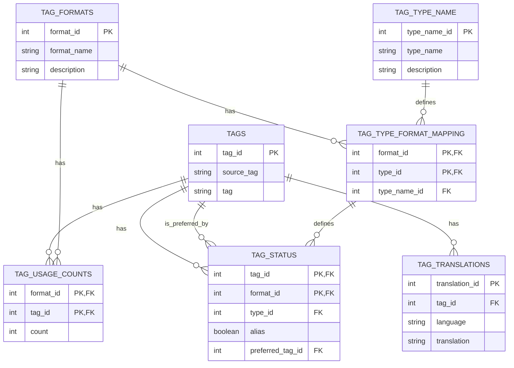

# genai-tag-db-tools

## 概要

genai-tag-db-toolsは、異なるプラットフォーム間でタグ、その翻訳、使用回数、関連性を統一したデータベースとして管理するためのツールセットです。このプロジェクトは、さまざまなソースからタグデータを収集し、整理し、効率的に検索・管理できるようにすることを目的としています。

## 主な機能

- タグの検索と管理
- タグの翻訳管理（多言語サポート）
- 異なるプラットフォーム間でのタグ種類の分類
- エイリアスと推奨タグの管理
- 異なるフォーマットでのタグ使用回数の追跡
- タグ統計情報の表示
- CSVファイルからのデータインポート

## プロジェクト構造

```bash
genai-tag-db-tools/
├── CSVToDatabaseProcessor.py
├── gui/
│   ├── MainWindow.py
│   ├── TagCleanerWidget.py
│   ├── TagRegisterWidget.py
│   ├── TagSearchWidget.py
│   └── TagStatisticsWidget.py
├── main.py
├── README.md
├── requirements.txt
├── tag_search.py
└── tags_v3.db
```

## データベース構造

データベースはSQLiteで実装されており、以下の主要なテーブルで構成されています：

1. `TAGS`: ソースと正規化された形式を含む、ユニークなタグを保存します。
2. `TAG_TRANSLATIONS`: 異なる言語でのタグの翻訳を含みます。
3. `TAG_FORMATS`: タグの異なるフォーマットまたはソース（例：danbooru、e621、derpibooru）を定義します。
4. `TAG_TYPE_NAME`: タグの種類（例：一般、アーティスト、著作権、キャラクター）を定義します。
5. `TAG_TYPE_FORMAT_MAPPING`: タグの種類を特定のフォーマットにマッピングします。
6. `TAG_USAGE_COUNTS`: 異なるフォーマットでのタグの使用回数を追跡します。
7. `TAG_STATUS`: タグのステータス（エイリアスや推奨形式を含む）を管理します。

## セットアップと実行

1. リポジトリをクローンします：

   ```bash
   git clone https://github.com/yourusername/genai-tag-db-tools.git
   cd genai-tag-db-tools
   ```

2. 必要な依存関係をインストールします：

   ```bash
   pip install -r requirements.txt
   ```

2.5 (未テスト)日本語で検索精度を上げるためにhf_to_sqlite_tag_transfer.pyを実行します：

   ```bash
   python hf_to_sqlite_tag_transfer.py
   ```

3. メインアプリケーションを実行します：

   ```bash
   python main.py
   ```

## 使用方法

アプリケーションは以下の主要な機能を提供します：

- タグ検索: キーワード、フォーマット、タイプ、言語などで高度な検索が可能です。
- タグクリーナー: 入力されたタグを正規化し、推奨タグに変換します。
- タグ登録: 新しいタグの追加や既存タグの情報更新ができます。
- タグ統計: データベース内のタグに関する統計情報を表示します。

## データソース

このプロジェクトは以下の主要なデータソースを使用しています：

1. [DominikDoom/a1111-sd-webui-tagcomplete](https://github.com/DominikDoom/a1111-sd-webui-tagcomplete): tags.dbの基となったCSVタグデータ
2. [applemango氏による日本語翻訳](https://github.com/DominikDoom/a1111-sd-webui-tagcomplete/discussions/265): CSVタグデータの日本語翻訳
3. としあき製作のCSVタグデータの日本語翻訳
4. [AngelBottomless/danbooru-2023-sqlite-fixed-7110548](https://huggingface.co/datasets/KBlueLeaf/danbooru2023-sqlite): danbooruタグのデータベース
5. [hearmeneigh/e621-rising-v3-preliminary-data](https://huggingface.co/datasets/hearmeneigh/e621-rising-v3-preliminary-data): e621およびrule34タグのデータベース
6. [p1atdev/danbooru-ja-tag-pair-20241015](https://huggingface.co/datasets/p1atdev/danbooru-ja-tag-pair-20241015): danbooruタグの日本語翻訳データベース

## ライセンス

このプロジェクトはMITライセンスの下で公開されています。詳細は[LICENSE](LICENSE)ファイルを参照してください。

## V3


