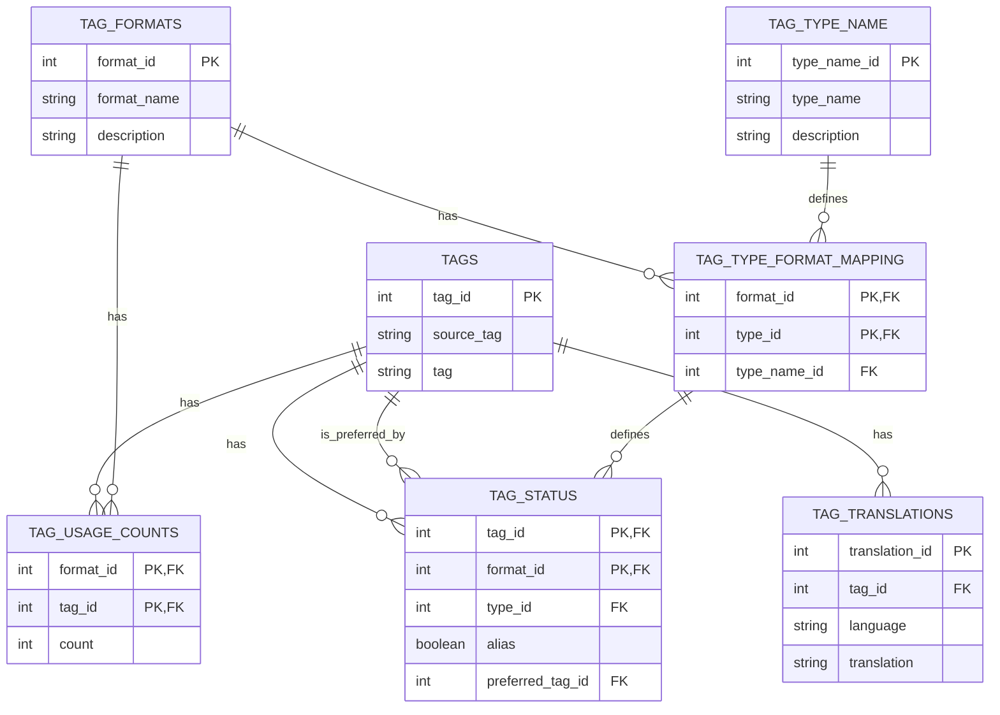

# genai-tag-db-tools

## 概要

genai-tag-db-toolsは、異なるプラットフォーム間でタグ、その翻訳、使用回数、関連性を統一したデータベースとして管理するためのツールセットです。このプロジェクトは、さまざまなソースからタグデータを収集し、整理し、効率的に検索・管理できるようにすることを目的としています。

## 主な機能

- タグの検索と管理
- タグの翻訳管理（多言語サポート）
- 異なるプラットフォーム間でのタグ種類の分類
- エイリアスと推奨タグの管理
- 異なるフォーマットでのタグ使用回数の追跡
- タグ統計情報の表示
- CSVファイルからのデータインポート

## プロジェクト構造

```bash
genai-tag-db-tools/
├── genai_tag_db_tools/          # メインパッケージ
│   ├── core/                    # コア機能
│   │   └── processor.py         # データ処理ロジック
│   ├── gui/                     # GUIコンポーネント
│   │   ├── designer/           # UI定義ファイル
│   │   ├── widgets/            # カスタムウィジェット
│   │   └── windows/            # メインウィンドウ実装
│   └── main.py                 # エントリーポイント
├── tools/                       # ユーティリティスクリプト
├── data/                        # データファイル
├── test/                        # テストコード
├── pyproject.toml              # プロジェクト設定
└── README.md
```

## データベース構造

データベースはSQLiteで実装され、以下の主要なテーブルで構成されています：

### コアテーブル

1. `TAGS`: タグの基本情報

   - `tag_id`: プライマリーキー
   - `source_tag`: 元のタグ文字列
   - `tag`: 正規化されたタグ
2. `TAG_TRANSLATIONS`: 多言語対応

   - `translation_id`: プライマリーキー
   - `tag_id`: TAGSテーブルへの参照
   - `language`: 言語コード
   - `translation`: 翻訳テキスト
3. `TAG_FORMATS`: タグのフォーマット定義

   - `format_id`: プライマリーキー
   - `format_name`: フォーマット名
   - `description`: 説明
4. `TAG_TYPE_NAME`: タグタイプの定義

   - `type_name_id`: プライマリーキー
   - `type_name`: タイプ名
   - `description`: 説明

### 関連テーブル

5. `TAG_TYPE_FORMAT_MAPPING`: タイプとフォーマットの関連付け
6. `TAG_USAGE_COUNTS`: 使用頻度の追跡
7. `TAG_STATUS`: タグのステータス管理

## インストール

1. リポジトリのクローン:

```bash
git clone https://github.com/yourusername/genai-tag-db-tools.git
cd genai-tag-db-tools
```

2. 開発環境のセットアップ:

```bash
py -3.12 -m venv venv
venv\Scripts\Activate.ps1
pip install -e ".[dev]"
```

### インストール その 2

試してないけど以下の方法でもインストールできるはず

1. 仮想環境のセットアップ

```
cd ワークスペースパス
py -3.12 -m venv venv
venv\Scripts\Activate.ps1
```

2. インストール

```bash
pip install git+https://github.com/NEXTAltair/genai-tag-db-tools.git
```

## アンインストール

```
pip uninstall genai-tag-db-tools
```

## 使用方法

### GUIアプリケーションの起動

```bash
python -m genai_tag_db_tools
```

### 主要な機能

1. **タグ検索**

   - キーワード検索
   - フォーマット別フィルタリング
   - タイプ別フィルタリング
   - 翻訳検索
2. **タグクリーナー**

   - タグの正規化
   - 非推奨タグの検出
   - 推奨タグへの変換
3. **タグ登録**

   - 新規タグの追加
   - 既存タグの更新
   - タグ関係の管理
4. **タグ統計**

   - 使用頻度分析
   - フォーマット別統計
   - タイプ別分布

## 開発者向け情報

### テストの実行

```bash
pytest
```

### コードスタイル

このプロジェクトはPEP 8に従い､コードフォーマッタには `black`を使用。

```bash
black genai_tag_db_tools
```

## データソース

このプロジェクトは以下の主要なデータソースを使用しています：

1. [DominikDoom/a1111-sd-webui-tagcomplete](https://github.com/DominikDoom/a1111-sd-webui-tagcomplete): tags.dbの基となったCSVタグデータ
2. [applemango氏による日本語翻訳](https://github.com/DominikDoom/a1111-sd-webui-tagcomplete/discussions/265): CSVタグデータの日本語翻訳
3. としあき製作のCSVタグデータの日本語翻訳
4. [AngelBottomless/danbooru-2023-sqlite-fixed-7110548](https://huggingface.co/datasets/KBlueLeaf/danbooru2023-sqlite): danbooruタグのデータベース
5. [hearmeneigh/e621-rising-v3-preliminary-data](https://huggingface.co/datasets/hearmeneigh/e621-rising-v3-preliminary-data): e621およびrule34タグのデータベース
6. [p1atdev/danbooru-ja-tag-pair-20241015](https://huggingface.co/datasets/p1atdev/danbooru-ja-tag-pair-20241015): danbooruタグの日本語翻訳データベース
7. [toynya/Z3D-E621-Convnext](https://huggingface.co/toynya/Z3D-E621-Convnext): e621 tagger convnext model のタグcsv #TODO: まだ反映させてない
8. [Updated danbooru.csv(2024-10-16) for WebUI Tag Autocomplete](https://civitai.com/models/862893?modelVersionId=965482): WebUI Tag Autocompleteのデフォルトのdanbooru.csvはやや古くなっているようなので、2024年10月16日時点での新しいデータに更新しました。#TODO: まだ反映させてない

## ライセンス

このプロジェクトはMITライセンスの下で公開されています。詳細は[LICENSE](LICENSE)ファイルを参照してください。

## V3


