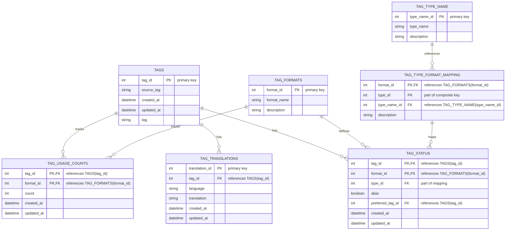

# genai-tag-db-tools

## 概要

**genai-tag-db-tools** は、画像生成AIで使用するタグを統合的に管理するためのデータベースツールである。
異なるプラットフォームやフォーマットで用いられるタグ情報を一元的に扱うことが可能となる。

主な目的は以下の通りだ。

- タグとその翻訳、使用頻度、関連性を統合管理
- タグタイプやフォーマットとの関連付けによるフィルタリングや統計分析
- GUIによるタグデータ参照・更新
- CLI経由の起動およびモジュールとして他プロジェクトからの利用が可能

## 主な機能

- タグの管理：新規登録、更新、エイリアス設定、推奨タグ設定など
- タグの参照：キーワード検索、翻訳参照、使用回数やタイプ・フォーマット別の統計表示
- GUIの提供：CLIコマンドからGUIを起動し、直感的にタグデータベースを閲覧・更新
- モジュール機能の提供：他プロジェクトからインポートし、データベース操作やタグ管理ロジックを活用可能

## インストール方法

### 環境要件

- Python 3.12以上
- Windows 11対応（他OSは未検証）

### インストール手順

1. 仮想環境の作成（任意）

   ```bash
   py -3.12 -m venv venv
   venv\Scripts\Activate.ps1
   ```
2. `genai-tag-db-tools` のインストール

   ```bash
   pip install genai-tag-db-tools
   ```

   またはGitHubリポジトリから直接インストール

   ```bash
   pip install git+https://github.com/NEXTAltair/genai-tag-db-tools.git
   ```

### アンインストール

```bash
pip uninstall genai-tag-db-tools
```

## 使用方法

### GUIの起動

インストール後、以下のコマンドでGUIを起動可能。

```bash
genai-tag-db-tools
```

またはPythonモジュールとして実行

```bash
python -m genai_tag_db_tools
```

### 他プロジェクトでの利用

`genai_tag_db_tools` をインポートし、データベース操作やタグ管理機能を他プロジェクト内から利用できる。

```python
from genai_tag_db_tools import some_module

```

## プロジェクト構造

```bash
genai-tag-db-tools/
├── genai_tag_db_tools/     # メインパッケージ
│   ├── core/               # コア機能
│   ├── gui/                # GUI関連
│   ├── data/               # データファイル (SQLite DB 等)
│   └── main.py             # エントリーポイント
├── tests/                  # テストコード
├── tools/                  # ツールスクリプト
├── docs/                   # ドキュメント
├── pyproject.toml          # プロジェクト設定
└── README.md
```

## データベース概要

主にSQLiteを用いてタグデータを管理する。
以下はエンティティとリレーションを示したER図。

### ER図



### テーブル関係

- **TAGS**: タグの基本情報
- **TAG_TRANSLATIONS**: タグ翻訳情報 (TAGSに従属)
- **TAG_FORMATS**: タグのフォーマット定義
- **TAG_TYPE_NAME**: タグタイプ定義
- **TAG_TYPE_FORMAT_MAPPING**: 各フォーマットとタイプを対応付け
- **TAG_USAGE_COUNTS**: タグのフォーマット別使用回数
- **TAG_STATUS**: タグの状態（エイリアス、推奨タグなど）を管理

## データソース

以下のデータソースを参考・利用。

1. [DominikDoom/a1111-sd-webui-tagcomplete](https://github.com/DominikDoom/a1111-sd-webui-tagcomplete): tags.dbの基となったCSVタグデータ
2. [applemango氏による日本語翻訳](https://github.com/DominikDoom/a1111-sd-webui-tagcomplete/discussions/265): CSVタグデータの日本語翻訳
3. としあき製作のCSVタグデータの日本語翻訳
4. [AngelBottomless/danbooru-2023-sqlite-fixed-7110548](https://huggingface.co/datasets/KBlueLeaf/danbooru2023-sqlite): danbooruタグのデータベース
5. [hearmeneigh/e621-rising-v3-preliminary-data](https://huggingface.co/datasets/hearmeneigh/e621-rising-v3-preliminary-data): e621およびrule34タグのデータベース
6. [p1atdev/danbooru-ja-tag-pair-20241015](https://huggingface.co/datasets/p1atdev/danbooru-ja-tag-pair-20241015): danbooruタグの日本語翻訳データベース
7. [toynya/Z3D-E621-Convnext](https://huggingface.co/toynya/Z3D-E621-Convnext): e621 tagger convnext model のタグcsv #TODO: まだ反映させてない
8. [Updated danbooru.csv(2024-10-16) for WebUI Tag Autocomplete](https://civitai.com/models/862893?modelVersionId=965482): WebUI Tag Autocompleteのデフォルトのdanbooru.csvはやや古くなっているようなので、2024年10月16日時点での新しいデータに更新しました。#TODO: まだ反映させてない

## ライセンス

本プロジェクトはMITライセンス下で公開している。詳細は[LICENSE](LICENSE)を参照。
