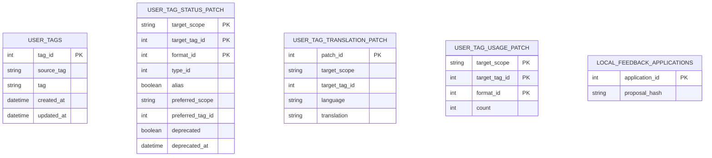

# genai-tag-db-tools

## 概要

**genai-tag-db-tools** は、画像生成AIで使用するタグを統合的に管理するためのデータベースツールである。
異なるプラットフォームやフォーマットで用いられるタグ情報を一元的に扱うことが可能となる。

主な目的は以下の通りだ。

- タグとその翻訳、使用頻度、関連性を統合管理
- タグタイプやフォーマットとの関連付けによるフィルタリングや統計分析
- 配布される **base DB**（読み取り専用）と、ユーザー固有の差分を持つ **user overlay DB** を合成して扱う
- タグの手動修正リコメンド（advisory）と、修正を base DB ビルドへ還元する feedback パイプライン
- GUIによるタグデータ参照・更新
- CLI経由の起動およびモジュールとして他プロジェクトからの利用が可能

## 主な機能

- タグの管理：新規登録、更新、エイリアス設定、推奨タグ設定など
- タグの参照：キーワード検索、翻訳参照、使用回数やタイプ・フォーマット別の統計表示
- **overlay パッチ DB**：base DB を書き換えず、ユーザー固有の追加タグ・status/翻訳/使用回数の差分を user DB に保持し、読み取り時に合成（`TagRef(scope, tag_id)` で base/user を横断）
- **リコメンド（advisory）**：`recommend_manual_refinement` などで手動修正候補・理由・スコアを返す（保存はブロックしない、自動置換しない）
- **feedback パイプライン**：承認済み修正を user-local へ適用、または base DB ビルド向け correction patch として export / validate / apply
- GUIの提供：CLIコマンドからGUIを起動し、直感的にタグデータベースを閲覧・更新
- モジュール機能の提供：安定 public API（トップレベル `genai_tag_db_tools` パッケージ）をインポートして他プロジェクトから利用可能

## インストール方法

### 環境要件

- Python 3.12以上
- [uv](https://docs.astral.sh/uv/) (Python package and project manager)
- Windows 11 / Linux対応

### インストール手順

1. uvのインストール（未インストールの場合）

   macOS/Linux:
   ```bash
   curl -LsSf https://astral.sh/uv/install.sh | sh
   ```

   Windows:
   ```powershell
   powershell -c "irm https://astral.sh/uv/install.ps1 | iex"
   ```

2. リポジトリをクローン

   ```bash
   git clone https://github.com/NEXTAltair/genai-tag-db-tools.git
   cd genai-tag-db-tools
   ```

3. 依存関係を同期（自動的に仮想環境を作成し依存パッケージをインストール）

   ```bash
   uv sync
   ```

## 使用方法

### CLIの利用

プロジェクト環境で実行（uv run がプロジェクトの仮想環境を自動的に使用）

```bash
uv run tag-db
```

サブコマンド例:

```bash
uv run tag-db search --query girl
uv run tag-db stats
```

### GUIの起動

GUIは明示的に `--gui` を指定して起動する。

```bash
uv run tag-db --gui
```

Pythonモジュールとして直接実行

```bash
uv run python -m genai_tag_db_tools --gui
```

### CLIコマンド

`tag-db` の各コマンド (`search` / `register` / `stats` / `convert` / `ensure-dbs` /
`aliases register` / `feedback`) は機械可読な JSONL を stdout に出力する（人間可読なログ・
進捗は stderr）。出力形式・標準エラーコード・exit code・副作用区分・非対話実行の契約は
[docs/cli.md](docs/cli.md) を参照。`describe` / `list-commands` で各コマンドの入出力モデルと
副作用分類も JSONL として取得できる。

- `aliases register`：JSONL/CSV から alias を一括登録（既定 dry-run、`--apply` で user DB へ書き込み）
- `feedback validate-base-patches` / `export-base-patches` / `apply-base-patches`：base DB
  correction patch の検証・出力・適用パイプライン

```bash
uv run tag-db search --query cat --limit 5
```

### 他プロジェクトでの利用

`genai_tag_db_tools` をインポートし、データベース操作やタグ管理機能を他プロジェクト内から利用できる。

```python
from genai_tag_db_tools import initialize_tag_cleaner, initialize_tag_searcher

# タグクリーニング
cleaner = initialize_tag_cleaner()
cleaned = cleaner.clean_tags("1girl,  standing___pose")

# タグ検索
searcher = initialize_tag_searcher()
results = searcher.search_tags("girl")
```

詳細なAPI仕様は[API Documentation](#api-documentation)を参照。

## プロジェクト構造

```bash
genai-tag-db-tools/
├── src/
│   └── genai_tag_db_tools/  # メインパッケージ
│       ├── db/              # データベース操作
│       │   ├── repository.py  # リポジトリパターン
│       │   ├── schema.py      # SQLAlchemyスキーマ
│       │   └── runtime.py     # ランタイム設定
│       ├── gui/             # GUI関連
│       │   ├── designer/    # UI定義ファイル(.ui/.py)
│       │   ├── widgets/     # 各種ウィジェット
│       │   └── windows/     # メインウィンドウ
│       ├── io/              # I/O操作
│       │   └── hf_downloader.py  # Hugging Faceダウンローダ
│       ├── services/        # アプリケーションサービス
│       │   ├── tag_search.py    # タグ検索サービス
│       │   └── app_services.py  # アプリケーションサービス
│       ├── utils/           # ユーティリティ
│       │   └── cleanup_str.py   # タグクリーニング
│       ├── core_api.py      # コアAPI
│       ├── models.py        # Pydanticモデル
│       └── main.py          # エントリーポイント
├── tests/                   # テストコード
│   ├── gui/                 # GUIテスト
│   └── unit/                # ユニットテスト
├── pyproject.toml           # プロジェクト設定
└── README.md
```

## データベース概要

主にSQLiteを用いてタグデータを管理する。
**重要**: タグデータベースはHugging Faceから自動的にダウンロードされ、標準キャッシュディレクトリ（`~/.cache/huggingface/hub/`）に保存される。初回起動時に自動ダウンロードが実行される。

以下はエンティティとリレーションを示したER図。

### ER図

```mermaid
erDiagram
    TAGS ||--o{ TAG_TRANSLATIONS : has
    TAGS ||--o{ TAG_STATUS : has
    TAGS ||--o{ TAG_USAGE_COUNTS : tracks
    TAG_FORMATS ||--o{ TAG_STATUS : defines
    TAG_FORMATS ||--o{ TAG_USAGE_COUNTS : tracks
    TAG_TYPE_FORMAT_MAPPING ||--o{ TAG_STATUS : maps
    TAG_TYPE_NAME ||--o{ TAG_TYPE_FORMAT_MAPPING : references

    TAGS {
        int tag_id PK
        string source_tag
        string tag
        datetime created_at
        datetime updated_at
    }

    TAG_TRANSLATIONS {
        int translation_id PK
        int tag_id FK
        string language
        string translation
        datetime created_at
        datetime updated_at
    }

    TAG_FORMATS {
        int format_id PK
        string format_name UK
        string description
    }

    TAG_TYPE_NAME {
        int type_name_id PK
        string type_name UK
        string description
    }

    TAG_TYPE_FORMAT_MAPPING {
        int format_id PK_FK
        int type_id PK
        int type_name_id FK
        string description
    }

    TAG_USAGE_COUNTS {
        int tag_id PK_FK
        int format_id PK_FK
        int count
        datetime created_at
        datetime updated_at
    }

    TAG_STATUS {
        int tag_id PK_FK
        int format_id PK_FK
        int type_id FK
        boolean alias
        int preferred_tag_id FK
        boolean deprecated
        datetime deprecated_at
        datetime source_created_at
        datetime created_at
        datetime updated_at
    }

    DATABASE_METADATA {
        string key PK
        string value
    }
```

上記は **base DB**（Hugging Face から配布される読み取り専用 DB）のスキーマ。これとは別に、
ユーザー固有の差分を保持する **user overlay DB**（`user_tags.sqlite`）がある。overlay DB は
base を書き換えず、`TagRef(scope, tag_id)` で base/user タグを横断参照するパッチ層として機能し、
読み取り時に base と合成される（`MergedTagReader`）。

### user overlay DB（差分パッチ層）


```mermaid
erDiagram
    USER_TAGS {
        int tag_id PK
        string source_tag
        string tag
        datetime created_at
        datetime updated_at
    }

    USER_TAG_STATUS_PATCH {
        string target_scope PK
        int target_tag_id PK
        int format_id PK
        int type_id
        boolean alias
        string preferred_scope
        int preferred_tag_id
        boolean deprecated
        datetime deprecated_at
    }

    USER_TAG_TRANSLATION_PATCH {
        int patch_id PK
        string target_scope
        int target_tag_id
        string language
        string translation
    }

    USER_TAG_USAGE_PATCH {
        string target_scope PK
        int target_tag_id PK
        int format_id PK
        int count
    }

    LOCAL_FEEDBACK_APPLICATIONS {
        int application_id PK
        string proposal_hash
    }
```

> 注: overlay パッチは base への hard FK を持たず、`target_scope`(`base`/`user`) + `target_tag_id`
> で対象タグを指す。`USER_TAGS.tag_id` は `USER_TAG_ID_OFFSET`(1,000,000,000) 以上で採番し
> base の tag_id と衝突しない。user DB は初期化時に旧スキーマを検出すると overlay スキーマへ
> 自動マイグレーションする（user DB のみ・冪等・backup 付き。base はビルド配布のため対象外）。

### テーブル関係

base DB:

- **TAGS**: タグの基本情報（tag_id, source_tag, tag）
- **TAG_TRANSLATIONS**: タグ翻訳情報（日本語・英語など多言語対応）
- **TAG_FORMATS**: タグのフォーマット定義（danbooru, e621, rule34など）
- **TAG_TYPE_NAME**: タグタイプ定義（character, copyright, artist, general, meta）
- **TAG_TYPE_FORMAT_MAPPING**: 各フォーマットとタイプの対応関係
- **TAG_USAGE_COUNTS**: タグのフォーマット別使用回数統計
- **TAG_STATUS**: タグの状態管理（エイリアス、推奨タグ、非推奨フラグ、作成日時）
- **DATABASE_METADATA**: データベースメタ情報（バージョン、ダウンロード日時など）

user overlay DB:

- **USER_TAGS**: base に存在しないユーザー定義タグ（`tag_id >= 1,000,000,000`）
- **USER_TAG_STATUS_PATCH**: base/user タグへの status 差分（複合 PK: `target_scope, target_tag_id, format_id`）。`preferred_scope` + `preferred_tag_id` で alias 先を cross-DB 指定
- **USER_TAG_TRANSLATION_PATCH**: base/user タグへの翻訳差分（FK なし）
- **USER_TAG_USAGE_PATCH**: base/user タグへの使用回数差分（FK なし）
- **LOCAL_FEEDBACK_APPLICATIONS**: user-local feedback apply の audit record

## データソース

以下のデータソースを参考・利用。

1. [DominikDoom/a1111-sd-webui-tagcomplete](https://github.com/DominikDoom/a1111-sd-webui-tagcomplete): tags.dbの基となったCSVタグデータ
2. [applemango氏による日本語翻訳](https://github.com/DominikDoom/a1111-sd-webui-tagcomplete/discussions/265): CSVタグデータの日本語翻訳
3. としあき製作のCSVタグデータの日本語翻訳
4. [AngelBottomless/danbooru-2023-sqlite-fixed-7110548](https://huggingface.co/datasets/KBlueLeaf/danbooru2023-sqlite): danbooruタグのデータベース
5. [hearmeneigh/e621-rising-v3-preliminary-data](https://huggingface.co/datasets/hearmeneigh/e621-rising-v3-preliminary-data): e621およびrule34タグのデータベース
6. [p1atdev/danbooru-ja-tag-pair-20241015](https://huggingface.co/datasets/p1atdev/danbooru-ja-tag-pair-20241015): danbooruタグの日本語翻訳データベース
7. [toynya/Z3D-E621-Convnext](https://huggingface.co/toynya/Z3D-E621-Convnext): e621 tagger convnext model のタグcsv #TODO: まだ反映させてない
8. [Updated danbooru.csv(2024-10-16) for WebUI Tag Autocomplete](https://civitai.com/models/862893?modelVersionId=965482): WebUI Tag Autocompleteのデフォルトのdanbooru.csvはやや古くなっているようなので、2024年10月16日時点での新しいデータに更新しました。#TODO: まだ反映させてない

## API Documentation

### 公開API

**安定 public API はトップレベル `genai_tag_db_tools` パッケージのみ**。下流の利用側は
`genai_tag_db_tools.db.*` / `genai_tag_db_tools.services.*` などの内部モジュールに依存して
はならない（リファクタで壊れる）。リーダ等のハンドルは下記ファクトリで取得し、モジュール
レベルのヘルパへ渡す。

```python
from genai_tag_db_tools import (
    # ファクトリ関数
    initialize_tag_cleaner,
    initialize_tag_searcher,

    # コアAPI関数
    build_downloaded_at_utc,
    convert_tags,
    ensure_databases,
    get_statistics,
    get_tag_formats,
    get_all_type_names,
    get_format_type_names,
    get_unknown_type_tags,
    register_tag,
    search_tags,
    update_tags_type_batch,

    # リコメンド（advisory）
    needs_manual_refinement,
    recommend_manual_refinement,
    recommend_tag_record_refinement,
    recommend_translation_quality,

    # feedback 適用（user-local）
    apply_approved_feedback,
    list_local_feedback_applications,

    # ハンドル取得ファクトリ / Protocol（型注釈用の不透明ハンドル）
    get_tag_reader,
    get_user_tag_reader,
    get_user_repository,
    create_tag_register_service,
    TagReaderProtocol,
    TagRegisterServiceProtocol,
    TagWriterProtocol,

    # Pydantic モデル
    RefinementRecommendation,
    RefinementReason,
    RefinementSuggestion,
    DbFeedbackProposal,
    ApprovedDbFeedback,
    ProposalTarget,
    LocalFeedbackApplicationRecord,
    LocalFeedbackApplyResult,
    TagTypeUpdate,

    # クラス
    TagCleaner,
    TagSearcher,
)
```

後方互換のためのトップレベル別名も提供する（`MergedTagReader = TagReaderProtocol`、
`get_default_reader = get_tag_reader`）。内部モジュール直 import からの移行は import 行の
差し替えだけで済む。

### TagCleaner

タグ文字列のクリーニング・正規化を行うクラス。

**主なメソッド**:
- `clean_format(tags: str) -> str`: タグフォーマットのクリーニング
- `clean_tags(tag: str) -> str`: 個別タグのクリーニング（重複除去、アンダースコア正規化）
- `clean_caption(caption: str) -> str`: キャプション文のクリーニング
- `convert_prompt(prompt: str) -> str`: プロンプト文の変換

**使用例**:
```python
cleaner = initialize_tag_cleaner()
cleaned = cleaner.clean_tags("1girl,  standing___pose")
# -> "1girl, standing_pose"
```

### TagSearcher

タグデータベースの検索・変換を行うクラス。

**主なメソッド**:
- `search_tags(query: str, ...) -> list[TagSearchRow]`: タグ検索
- `convert_tag(tag: str, format_name: str) -> str | None`: タグ変換
- `get_tag_formats() -> list[str]`: タグフォーマット一覧取得
- `get_format_id(format_name: str) -> int | None`: フォーマットID取得

**使用例**:
```python
searcher = initialize_tag_searcher()
results = searcher.search_tags("girl")
converted = searcher.convert_tag("1girl", "danbooru")
```

### コアAPI関数

#### `convert_tags(repo, tags: str, format_name: str, separator: str = ", ") -> str`

カンマ区切りタグを指定フォーマットに一括変換。

**パラメータ**:
- `repo`: MergedTagReaderインスタンス
- `tags`: カンマ区切りタグ文字列
- `format_name`: 変換先フォーマット名（"danbooru", "e621"など）
- `separator`: 出力時の区切り文字（デフォルト: ", "）

**戻り値**: 変換後のタグ文字列

#### `search_tags(repo, request: TagSearchRequest) -> TagSearchResult`

タグデータベースの高度な検索機能。

**主要フィルタ**:
- `query`: 検索クエリ文字列
- `format_names`: フォーマット指定
- `type_names`: タグタイプ指定（character, copyright, artistなど）
- `min_usage` / `max_usage`: 使用回数範囲
- `include_aliases`: エイリアスを含むか
- `resolve_preferred`: 推奨タグに解決するか

#### `get_statistics(repo) -> TagStatisticsResult`

データベース全体の統計を取得。

**戻り値フィールド**:
- `total_tags`: 総タグ数
- `total_aliases`: エイリアス数
- `total_formats`: フォーマット数
- `total_types`: タグタイプ数

### リコメンド（advisory）

タグを手で直すべきかを判定する advisory API。保存をブロックせず、自動置換もしない。

#### `recommend_manual_refinement(tag, repo=None, *, format_name="unknown") -> RefinementRecommendation`

タグの正規化候補・要否・スコア・理由・修正候補を返す。`repo` を渡すと alias/deprecated/type/
usage など DB 由来の理由も付く（未指定時はルールベースのみ）。`needs_manual_refinement(tag)` は
`needs_refinement` だけを返す薄い互換ヘルパ。

関連: `recommend_translation_quality(source_tag, translation, *, language="ja")`、
`recommend_tag_record_refinement(row, *, format_name=None, target_scope=None, repo=None)`。

### feedback 適用（user-local）

`apply_approved_feedback(...)` は人間承認済みの `ApprovedDbFeedback` を **user-local overlay DB
にのみ** 適用する（base DB は書き換えない）。適用履歴は `list_local_feedback_applications()` で
監査できる。base DB ビルドへ還元する場合は CLI の `feedback export-base-patches` /
`validate-base-patches` / `apply-base-patches` を使う。

### データベースアクセス

リーダはトップレベルのファクトリから取得する（内部モジュールを直接 import しない）。

```python
from genai_tag_db_tools import get_tag_reader

# 読み取り専用リポジトリ取得（base + user overlay を合成）
repo = get_tag_reader()
```

## ライセンス

本プロジェクトはMITライセンス下で公開している。詳細は[LICENSE](LICENSE)を参照。
