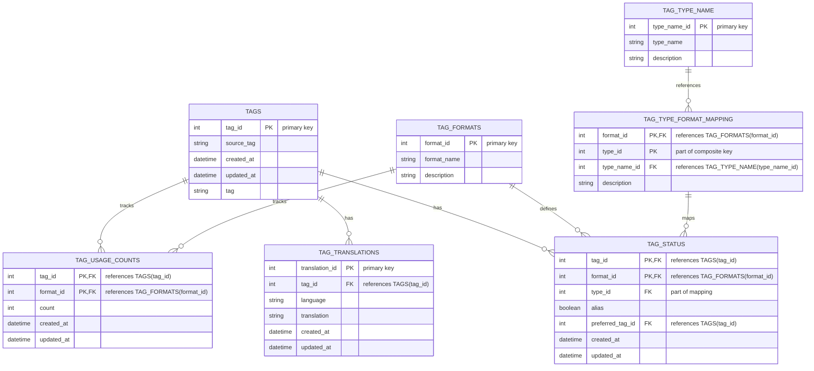

# genai-tag-db-tools

## Overview

**genai-tag-db-tools** is a database tool designed to centrally manage tags used in image generation AI.
It enables unified handling of tag information utilized across various platforms and formats.

The main objectives are as follows:

- Integrated management of tags, their translations, frequency of use, and relevance
- Filtering and statistical analysis by associating tag types with specific formats
- A GUI for browsing and updating tag data
- Support for launching via CLI and using as a module from other projects

## Key Features

- Tag Management: Registering new tags, updates, setting aliases, recommended tags, etc.
- Tag Referencing: Keyword search, translation lookup, usage counts, and statistics by tag type and format
- GUI Provision: Launch the GUI from the CLI command for intuitive browsing and updating of the tag database
- Modular Usage: Import and use the database operations and tag management logic in other projects

## Installation

### Requirements

- Python 3.12 or higher
- Verified on Windows 11 (other OS not tested)

### Installation Steps

1. Create a virtual environment (optional):

   ```bash
   py -3.12 -m venv venv
   venv\Scripts\Activate.ps1
   ```

2. Install `genai-tag-db-tools`:

   ```bash
   pip install genai-tag-db-tools
   ```

   Or install directly from the GitHub repository:

   ```bash
   pip install git+https://github.com/NEXTAltair/genai-tag-db-tools.git
   ```

### Uninstallation

```bash
pip uninstall genai-tag-db-tools
```

## Usage

### Launching the GUI

After installation, you can start the GUI using the following command:

```bash
genai-tag-db-tools
```

Or run as a Python module:

```bash
python -m genai_tag_db_tools
```

### Using in Other Projects

You can import `genai_tag_db_tools` into other projects and utilize database operations and tag management functionality.

```python
from genai_tag_db_tools import some_module

# Example usage of tag management features in another project
```

## Project Structure (Example)

```bash
genai-tag-db-tools/
├── genai_tag_db_tools/     # Main package
│   ├── core/               # Core functionalities
│   ├── gui/                # GUI related
│   ├── data/               # Data files (e.g., SQLite DB)
│   └── main.py             # Entry point
├── tests/                  # Test code
├── pyproject.toml          # Project settings
└── README.md
```

## Database Overview

SQLite is primarily used to manage tag data. The following is an example ER diagram of entities and their relationships.

### ER Diagram



### Table Relationships

- **TAGS**: Basic tag information
- **TAG_TRANSLATIONS**: Tag translation information (dependent on TAGS)
- **TAG_FORMATS**: Definitions of tag formats
- **TAG_TYPE_NAME**: Definitions of tag types
- **TAG_TYPE_FORMAT_MAPPING**: Mapping between formats and types
- **TAG_USAGE_COUNTS**: Format-specific usage counts for tags
- **TAG_STATUS**: Manages tag statuses (aliases, recommended tags, etc.)

## Data Sources

References and utilized data sources:

1. [DominikDoom/a1111-sd-webui-tagcomplete](https://github.com/DominikDoom/a1111-sd-webui-tagcomplete): CSV-based tag data that served as the base for tags.db
2. [Japanese translations by applemango](https://github.com/DominikDoom/a1111-sd-webui-tagcomplete/discussions/265): Japanese translations of the CSV tag data
3. Japanese translations of CSV tag data by “としあき”
4. [AngelBottomless/danbooru-2023-sqlite-fixed-7110548](https://huggingface.co/datasets/KBlueLeaf/danbooru2023-sqlite): Database for danbooru tags
5. [hearmeneigh/e621-rising-v3-preliminary-data](https://huggingface.co/datasets/hearmeneigh/e621-rising-v3-preliminary-data): Database of e621 and rule34 tags
6. [p1atdev/danbooru-ja-tag-pair-20241015](https://huggingface.co/datasets/p1atdev/danbooru-ja-tag-pair-20241015): Japanese translation database for danbooru tags
7. [toynya/Z3D-E621-Convnext](https://huggingface.co/toynya/Z3D-E621-Convnext): CSV tags from e621 tagger convnext model #TODO: Not yet integrated
8. [Updated danbooru.csv (2024-10-16) for WebUI Tag Autocomplete](https://civitai.com/models/862893?modelVersionId=965482): Updated danbooru.csv as of October 16, 2024 for WebUI Tag Autocomplete #TODO: Not yet integrated

## For Developers

### Running Tests

```bash
pytest
```

Display coverage:

```bash
pytest --cov=genai_tag_db_tools --cov-report=term-missing
```

### Code Style

Use `black`, `ruff`, and `pyright` for code quality and type checks. Refer to `pyproject.toml` for details.

```bash
black genai_tag_db_tools
ruff check genai_tag_db_tools
pyright
```

## License

This project is released under the MIT License. See [LICENSE](LICENSE) for details.
