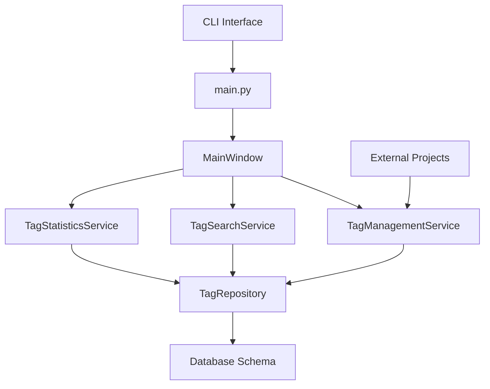
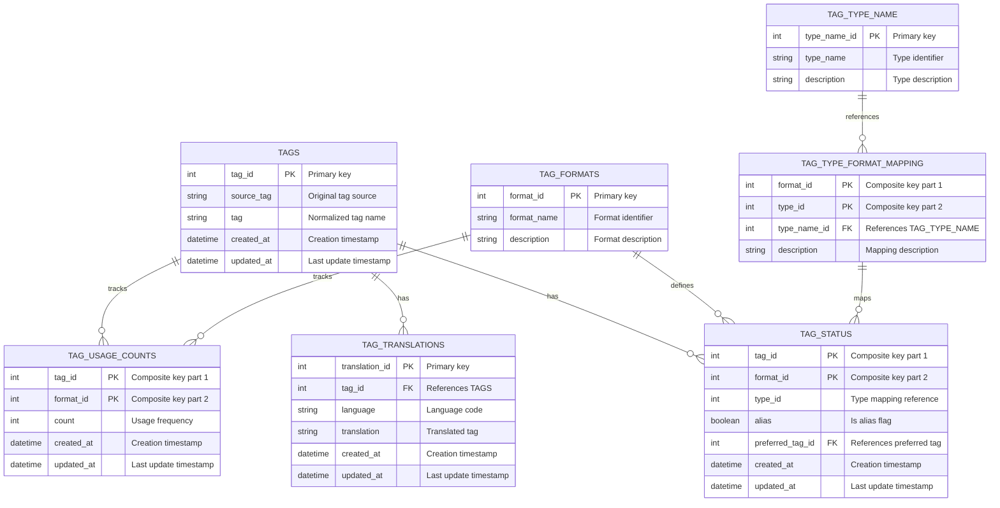
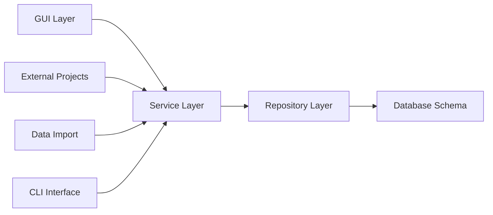
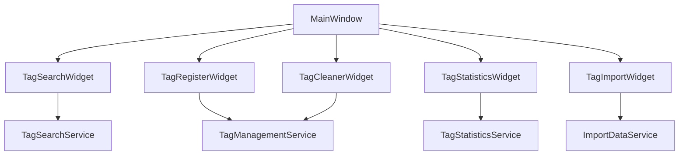
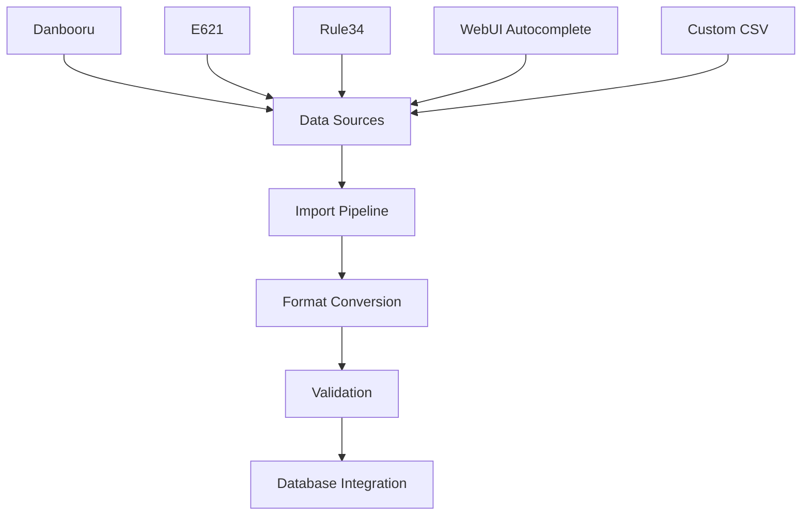
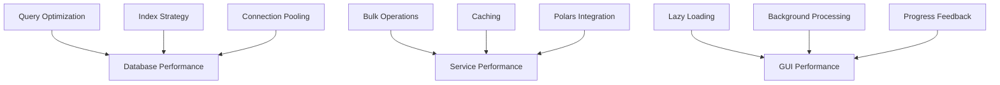
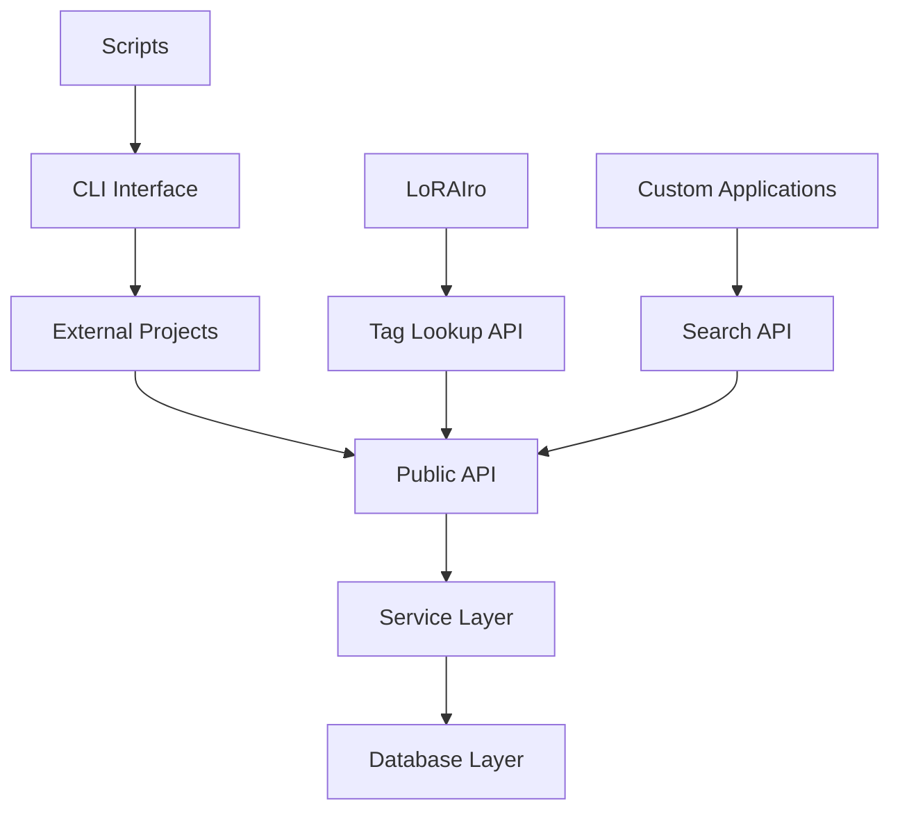
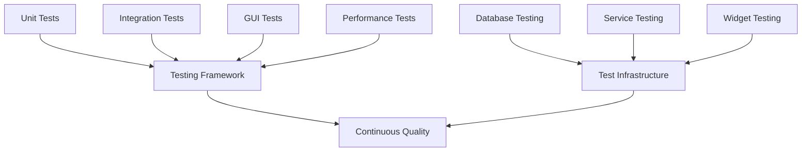

# genai-tag-db-tools Architecture Documentation

## System Overview

genai-tag-db-tools is a comprehensive tag database management application designed for AI-generated image workflows. The system provides unified tag management across different platforms and formats, with sophisticated database relationships, efficient search capabilities, and intuitive GUI operation.

## Architectural Principles

### Database-Centric Design
The application is built around a sophisticated SQLite database schema with complex relationships designed for tag management at scale.

### Service Layer Architecture
Clear separation between data access, business logic, and presentation layers ensures maintainability and testability.

### Performance-First Approach
Optimized for handling large tag datasets with efficient queries, indexing strategies, and bulk operations.

### Integration-Ready Design
Designed as both a standalone application and a library for integration with external projects like LoRAIro.

## System Components

### Core Application Flow



#### Entry Points
- **`src/genai_tag_db_tools/main.py`**: Primary application entry point
- **CLI Command**: `tag-db` for direct GUI launch
- **Module Import**: Library integration for external projects
- **Python Module**: `python -m genai_tag_db_tools` execution

#### GUI Architecture
- **MainWindow**: Central application coordinator
- **Widget System**: Modular GUI components for different operations
- **Qt Designer Integration**: UI definitions separated from logic
- **Signal/Slot Communication**: Event-driven component interaction

### Database Architecture

The database schema is designed for comprehensive tag management with complex relationships.



#### Core Database Features

**Multi-Platform Tag Support**
- Different tag formats (Danbooru, E621, Rule34, etc.)
- Format-specific tag types and categories
- Cross-platform tag mapping and compatibility

**Translation Management**
- Multi-language tag support
- Translation quality tracking
- Language-specific search capabilities

**Usage Analytics**
- Tag frequency tracking per format
- Usage trend analysis
- Popularity metrics and statistics

**Tag Relationships**
- Alias management with preferred tag references
- Tag type categorization
- Hierarchical tag relationships

### Service Layer Architecture

The service layer encapsulates business logic and provides clean interfaces for GUI and external integration.



#### Core Services

**TagManagementService**
- Tag registration and updates
- Alias management and preferred tag assignment
- Tag validation and normalization
- Batch tag operations

**TagSearchService**
- Advanced tag search with fuzzy matching
- Multi-language search capabilities
- Format-specific filtering
- Performance-optimized queries

**TagStatisticsService**
- Usage frequency analysis
- Trend tracking and reporting
- Format-specific statistics
- Data visualization support

**ImportDataService**
- Multi-source data import (CSV, database)
- Format conversion and mapping
- Duplicate detection and resolution
- Bulk import optimization

### GUI Architecture

The GUI follows a modular widget-based architecture with clear separation of concerns.



#### Widget Architecture

**Modular Design**
- Self-contained widgets for specific functionality
- Clear interfaces between widgets and services
- Reusable components across different contexts

**Qt Designer Integration**
- UI definitions in `.ui` files
- Automatic Python code generation
- Separation of visual design from logic

**Event-Driven Communication**
- Qt signals/slots for component interaction
- Loose coupling between interface components
- Responsive user interface design

#### Core Widgets

**TagSearchWidget**
- Real-time search with instant results
- Advanced filtering by format and type
- Multi-language search support
- Export functionality for search results

**TagRegisterWidget**
- New tag registration with validation
- Translation management interface
- Alias and preferred tag assignment
- Bulk registration capabilities

**TagStatisticsWidget**
- Usage frequency visualization
- Trend analysis and reporting
- Format-specific statistics display
- Export capabilities for analytics

**TagCleanerWidget**
- Duplicate tag detection and resolution
- Data consistency validation
- Batch cleanup operations
- Quality assurance tools

**TagImportWidget**
- Multi-format data import interface
- Progress tracking for large imports
- Error handling and validation
- Import preview and confirmation

### Data Source Integration

The system supports multiple data sources with sophisticated import and conversion capabilities.



#### Supported Data Sources

**Danbooru Database**
- Comprehensive anime/manga tag collections
- Japanese translation support
- Category-based tag organization
- High-quality tag relationships

**E621 Database**
- Furry art community tags
- Detailed tag categorization
- Species and character tags
- NSFW content tagging

**Rule34 Database**
- General artwork tags
- Cross-platform compatibility
- Extensive tag coverage
- Community-driven content

**WebUI Tag Autocomplete**
- Stable Diffusion compatible tags
- AI model training optimized
- Popular tag collections
- Regular updates and maintenance

**Custom Data Sources**
- CSV import capabilities
- User-defined tag collections
- Custom format support
- Flexible data mapping

### Performance Architecture

Performance optimization is built into every layer of the system.



#### Database Performance

**Indexing Strategy**
- Strategic indexes on frequently queried columns
- Composite indexes for complex queries
- Foreign key indexes for join optimization
- Regular index maintenance and analysis

**Query Optimization**
- Efficient JOIN operations for complex relationships
- Parameterized queries for security and performance
- Query result caching for repeated operations
- Database connection pooling for concurrent access

**Bulk Operations**
- Batch processing for large dataset operations
- Transaction optimization for bulk inserts
- Memory-efficient data processing
- Progress tracking for long-running operations

#### Service Layer Performance

**Polars Integration**
- High-performance data processing for large datasets
- Memory-efficient operations
- Parallel processing capabilities
- Optimized data transformation pipelines

**Caching Strategies**
- Frequently accessed data caching
- Search result caching with TTL
- Translation cache for multi-language support
- Statistics cache for dashboard performance

**Memory Management**
- Efficient memory usage for large tag collections
- Garbage collection optimization
- Resource cleanup automation
- Memory leak prevention

#### GUI Performance

**Responsive Interface**
- Background threading for long operations
- Progress indicators for user feedback
- Non-blocking UI operations
- Smooth scrolling for large lists

**Efficient Data Display**
- Virtual scrolling for large result sets
- Lazy loading of detailed information
- Optimized rendering for complex data
- Real-time search result updates

## Integration Architecture

### External Project Integration

The system is designed for seamless integration with external projects.



#### Integration Patterns

**Library Integration**
```python
from genai_tag_db_tools.services.tag_search import TagSearchService
from genai_tag_db_tools.services.tag_management import TagManagementService

# Initialize services
search_service = TagSearchService(database_path="tags.db")
management_service = TagManagementService(database_path="tags.db")

# Use services
results = search_service.search_tags("landscape")
new_tag = management_service.register_tag("new_tag", "source_tag")
```

**CLI Integration**
```bash
# Launch GUI application
tag-db

# Module execution
python -m genai_tag_db_tools

# Library verification
python -c "from genai_tag_db_tools import TagSearchService; print('Available')"
```

### LoRAIro Integration

Specific integration patterns for the LoRAIro image annotation application.

**Tag Suggestion Integration**
- Real-time tag suggestions during image annotation
- Relevance scoring based on usage statistics
- Multi-language tag suggestions
- Format-specific tag filtering

**Database Sharing**
- Shared tag database access
- Concurrent access management
- Transaction coordination
- Data consistency maintenance

**Search Integration**
- Advanced tag search capabilities in LoRAIro
- Cross-reference tag relationships
- Quality assessment based on tag statistics
- Batch tag operations for large datasets

## Quality Assurance Architecture

### Testing Strategy

Comprehensive testing across all system layers ensures reliability and performance.



#### Test Categories

**Unit Tests**
- Individual component testing with mocking
- Service layer business logic validation
- Database operation testing with test databases
- Utility function verification

**Integration Tests**
- End-to-end workflow testing
- Database integration with real data
- Service coordination validation
- External API integration testing

**GUI Tests**
- Widget functionality testing with pytest-qt
- User interaction simulation
- Visual component validation
- Event handling verification

**Performance Tests**
- Large dataset handling validation
- Query performance benchmarking
- Memory usage monitoring
- Concurrent access testing

### Data Quality Assurance

**Validation Framework**
- Input data validation at all entry points
- Database constraint enforcement
- Data integrity checking procedures
- Error handling and recovery mechanisms

**Quality Metrics**
- Test coverage monitoring (target: 75%+)
- Performance benchmarking
- Data consistency validation
- User experience metrics

## Deployment Architecture

### Application Distribution

**Standalone Application**
- Self-contained executable with embedded database
- Cross-platform compatibility (Windows, macOS, Linux)
- Easy installation and setup procedures
- Automatic dependency management

**Library Distribution**
- PyPI package distribution for library usage
- Clear API documentation and examples
- Version compatibility management
- Integration guides for external projects

### Configuration Management

**Database Configuration**
- Flexible database path configuration
- Connection parameter optimization
- Backup and recovery procedures
- Migration management and versioning

**Application Settings**
- User preference persistence
- GUI layout and behavior customization
- Search and display preferences
- Import/export format preferences

## Future Architecture Considerations

### Scalability Enhancements

**Distributed Architecture**
- Multi-database support for large tag collections
- Horizontal scaling capabilities
- Cloud database integration options
- Synchronization mechanisms for distributed data

**Performance Optimization**
- Async/await database operations
- Advanced caching strategies
- Query optimization and monitoring
- Memory usage optimization

### Feature Extensions

**API Development**
- RESTful web API for remote access
- GraphQL interface for flexible queries
- Webhook support for real-time updates
- API rate limiting and authentication

**Machine Learning Integration**
- Automated tag suggestion algorithms
- Tag relationship discovery
- Usage pattern analysis
- Quality scoring automation

### Technology Evolution

**Modern Database Features**
- Advanced SQLite features utilization
- Full-text search integration
- JSON column support for flexible data
- Spatial data support for geographic tags

**GUI Modernization**
- Modern Qt6 features adoption
- Enhanced accessibility support
- Mobile-responsive design considerations
- Progressive web application options

This architecture provides a robust foundation for comprehensive tag management while maintaining flexibility for future enhancements and scaling requirements.